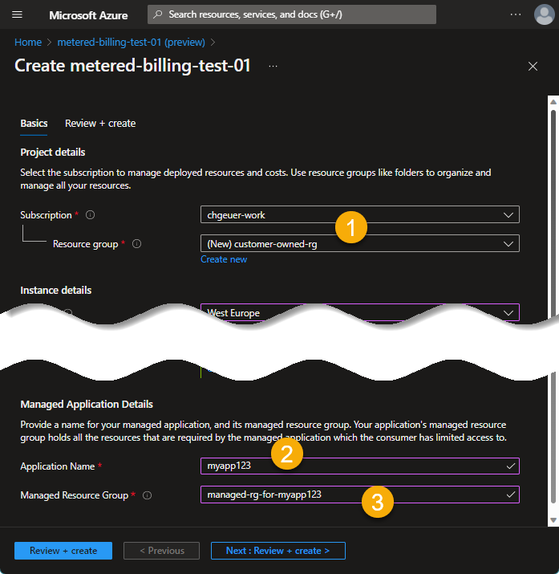
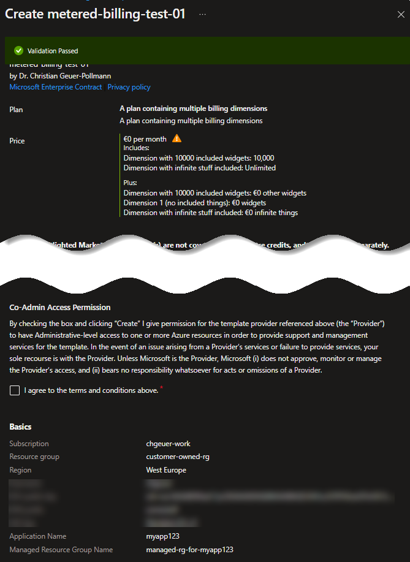
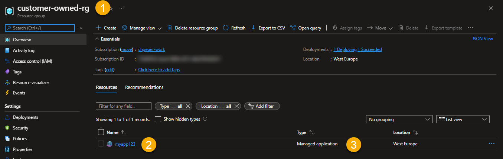
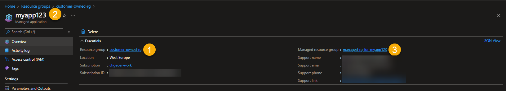

# Picking the correct ID when submitting meters to the Azure Metering API

> tl;dr: Don't know whether to use `resourceId` and `resourceUri` when submitting usage events to `https://marketplaceapi.microsoft.com/api/usageEvent` or `.../batchUsageEvent`? Read on...

In Azure Marketplace, both *SaaS* offers and *Azure Managed Applications* allow the publisher to submit custom usage events to the [Metering service API](https://docs.microsoft.com/en-us/azure/marketplace/marketplace-metering-service-apis) (if you have enabled custom metering dimensions on your marketplace offer). The metering service API accept either a single usage event (on the `usageEvent` endpoint), or a batch (on the `batchUsageEvent` endpoint). A single usage event JSON message looks like this: 

```json
{
  "effectiveStartTime": "2018-12-01T08:00:00", 
  "planId": "id-of-the-plan-as-configured-in-partner-center"
  "dimension": "id-of-the-billing-dimension-as-configured-in-partner-center", 
  "quantity": 5.0, 
  "resourceId": "deadbeef-123...guid" ... or ... "resourceUri": "/subscription/..."
}
```

In this message, the first 4 lines are kind-of-easy: `effectiveStartTime` it the hour (in UTC) for which the usage has been aggregated. `planId` and `dimension` correspond are the identifiers configured in Partner Center, `quantity` is the JSON serialization of the quantity of usage that happened for the given dimension in the given hour, either something like `5` or `5.0` (or `0.02` or `23892`). 

But what about that `resource...` stuff, do I have to use a `"resourceId"`, or `"resourceUri"`, or even both?!? And where does that value come from? Well, that depends on the offer type you have..

## Software-as-a-Service (SaaS) offers - use `resourceId`

For a [SaaS](https://docs.microsoft.com/en-us/azure/marketplace/partner-center-portal/saas-metered-billing) offer, it is comparably easy: When a customer purchases a SaaS offer, they get sent to your '[landing page](https://docs.microsoft.com/en-us/azure/marketplace/azure-ad-transactable-saas-landing-page)', from which you call the '[SaaS fulfillment Subscription APIs v2](https://docs.microsoft.com/en-us/azure/marketplace/partner-center-portal/pc-saas-fulfillment-subscription-api)', specifically the [`api/saas/subscriptions/resolve`](https://docs.microsoft.com/en-us/azure/marketplace/partner-center-portal/pc-saas-fulfillment-subscription-api#resolve-a-purchased-subscription) endpoint, which returns (amongst other things) the 'purchased SaaS subscription ID' back to your solution:

```json
{
  "id": "<guid>", // purchased SaaS subscription ID, which will be used as resourceId in a usage event
  "subscriptionName": "Contoso Cloud Solution", // SaaS subscription name
  "offerId": "offer1", // purchased offer ID
  "planId": "silver", // purchased offer's plan ID
  ...
}
```

You must use the `id` from that response, i.e. the *purchased SaaS subscription ID*, as `"resourceID"` value in your metering API usage event submissions. This thing is GUID, which your SaaS solution must use to track and aggregate the usage of your customer.

The SaaS offer also has a `resourceUri`. When purchasing a SaaS offer, the purchaser puts the offer into one of their resource groups (`customer-rg1` below), and gives it a name (`SomeNameTheCustomerChose` below). The ARM resource ID of that would be the `resourceUri`, something like this

```text
/subscriptions/.../resourceGroups/customer-rg1/providers/Microsoft.SaaS/resources/SomeNameTheCustomerChose
```

## Azure Managed Applications - use `resourceUri`

An *Azure Application Offer* can either be a '*solution template*' or a '*managed application*'. Only the 'managed app' (Azure Managed Application) can submit usage to the [Metering service API](https://docs.microsoft.com/en-us/azure/marketplace/marketplace-metering-service-apis). A managed app is a bunch of resources described in an ARM template, which are deployed into a '*managed resource group*' in the customer's Azure subscription. The ISV/publisher has administrative control over these resources to 'manage' them, therefore the name 'managed app'; the customer themselves usually cannot change the resource in the managed resource group, even though they live in the customer's subscription.

When the customer purchases the managed app via the Marketplace in the Azure Portal, they select a resource group where the 'managed app' object itself lives, and that object is something of type `Microsoft.Solutions/applications`. The resource group which contains the managed app resource object is *owned by the customer*. This managed app resource 'points' to the managed resource group, and vice versa. 

Consider the following purchase screen (omitting the app-specific details):



You can see the following relevant details:

1. The '**Resource group**' (1) at the top, named **`customer-owned-rg`**, is the resource group in which the managed app object will be deployed. The customer has full control over it. In 
2. The '**Application Name**' (2) in the 'Managed Application Details' is the customer-chosen name for the managed app object. Our example here is **`myapp123`**. 
3. The '**Managed Resource Group**' (3) at the bottom is the RG where all resources from the ISV's ARM-template will be deployed to. In our example, this is **`managed-rg-for-myapp123`**. 
   - The customer has (usually) no control over this. 
   - The ISV/publisher can manage the resources in it.
   - The 'Managed Resource Group' field initially has a value of `'MTG-somethingsomething'`, but the customer can choose the managed resource group's name, to better align with own naming conventions. 

The purchase confirmation summarizes the data again:



After the managed app has been fully deployed, the customer can see the managed app object in their own resource group:


After the deployment, the customer can see the their managed app deployment:



Clicking onto this resource gives us the internal details:



To summarize our progress up until now, in our sample, we have the following names:

|                        | Name                      |
| ---------------------- | ------------------------- |
| Resource group         | `customer-owned-rg`       |
| Application Name       | `myapp123`                |
| Managed Resource Group | `managed-rg-for-myapp123` |


The resource ID of the managed app in the ARM control plane is this:

```text
/subscriptions/.../resourceGroups/customer-owned-rg/providers/Microsoft.Solutions/applications/myapp123
```

The resource ID of the managed resource group

```text
/subscriptions/.../resourceGroups/managed-rg-for-myapp123
```

### The `resourceUri` for a managed app

Now we know which `resourceUri` we could use when submitting usage records to the metering API: The `resourceUri` is the ARM resource ID **of the managed resource group**:

```json
{
  "effectiveStartTime": "2018-12-01T08:00:00", 
  "planId": "plan1"
  "dimension": "id-of-the-billing-dimension-as-configured-in-partner-center", 
  "quantity": 5.0, 
  "resourceUri": "/subscriptions/.../resourceGroups/managed-rg-for-myapp123"
}
```

The good thing with the `resourceUri` is that it's immediately available, even during the actual ARM deployment...

### The `resourceId` for a managed app

When we submit the usage to the metering API, we get back a response like this:

```json
 {
  "status": "Accepted",
  "usageEventId": "...",
  "messageTime": "2018-12-01T10:00:25.7798568Z",

  "effectiveStartTime": "2018-12-01T08:00:00", 
  "planId": "plan1"
  "dimension": "id-of-the-billing-dimension-as-configured-in-partner-center", 
  "quantity": 5.0, 
  "resourceUri": "/subscriptions/.../resourceGroups/managed-rg-for-myapp123",
  "resourceId": "accd441b-01e8-48c7-8c73-90a0ea5cec0a",
 }
```

It echoes our submitted request, and augments it with further details, such as `messageTime` (when the request arrived), the `"status": "Accepted"`, or a unique `usageEventId` (under which Azure tracks that submission internally). 

But - there is also a `resourceId`. Where did that came from, and could we have retrieved that ourself?

The `resourceId` is actually an ARM property on the managed app. Once Azure has fully (and successfully) provisioned all the resources in the managed resource group, Azure sets a `billingDetails` property on the managed app, which contains a `resourceUsageId` property, which is our `resourceId` for usage events:

```http
GET /subscriptions/.../resourceGroups/customer-owned-rg/providers/Microsoft.Solutions/applications/myapp123

{
    "id": "/subscriptions/.../resourceGroups/customer-owned-rg/providers/Microsoft.Solutions/applications/myapp123",
    "name": "myapp123",
    "type": "Microsoft.Solutions/applications",
    "kind": "MarketPlace",
    "location": "westeurope"
    "properties": {
        "billingDetails": {
            "resourceUsageId": "accd441b-01e8-48c7-8c73-90a0ea5cec0a"
        },
        "managedResourceGroupId": "/subscriptions/.../resourceGroups/managed-rg-for-myapp123",
        "provisioningState": "Succeeded",
        "managementMode": "Managed",
        "customerSupport": {...},
        "supportUrls": {...}
    },
    "plan": {
        "product": "metered-billing-test-01-preview",
        "name": "plan1",
        "publisher": "...",
        "version": "1.0.0"
    }
}
```

So after the (successful) deployment, **if you are authorized to read the managed app, which is not in the managed resource group, but in the customer's resource group**, then you can get the `.properties.billingDetails.resourceUsageId`. 

It is important to understand that the `billingDetails` are only set once the deployment successfully went through; you will not have access to the `billingDetails` during the ARM template provisioning.

So in a usage event, you can submit

```json
{
  "effectiveStartTime": "...", "planId": "...", "dimension": "..", "quantity": ..., 
  "resourceUri": "/subscriptions/.../resourceGroups/managed-rg-for-myapp123"
}
```

or

```json
{
  "effectiveStartTime": "...", "planId": "...", "dimension": "..", "quantity": ..., 
  "resourceId": "accd441b-01e8-48c7-8c73-90a0ea5cec0a"
}
```

or 

```json
{
  "effectiveStartTime": "...", "planId": "...", "dimension": "..", "quantity": ..., 
  "resourceUri": "/subscriptions/.../resourceGroups/managed-rg-for-myapp123",
  "resourceId": "accd441b-01e8-48c7-8c73-90a0ea5cec0a",
}
```

However, when submitting both, these must obviously belong together... 

Just do what's most simple for you to retrieve.

## Summary

For a **SaaS offer**, you should be using the SaaS subscription ID (a GUID) as `resourceId`. 

For a **managed app**, you should use the ARM resource ID of the managed resource group (something like `/subscriptions/.../resourceGroups/...`) as `resourceUri`.

